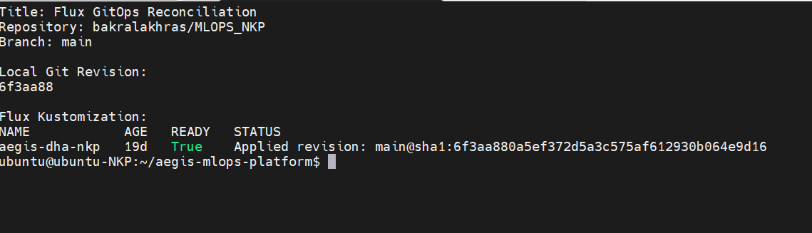
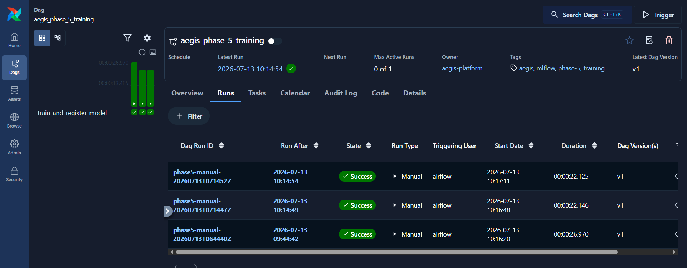
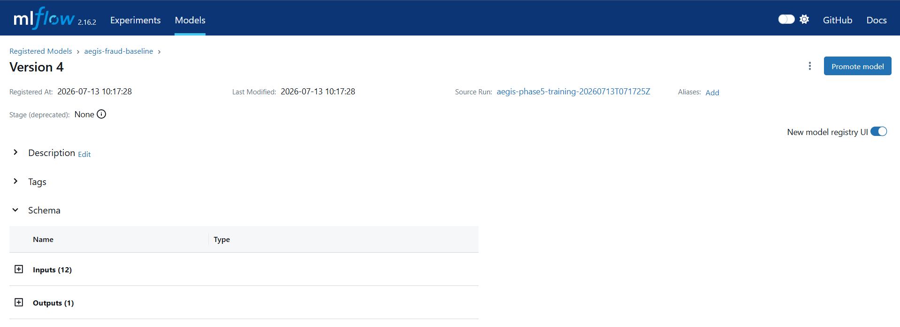
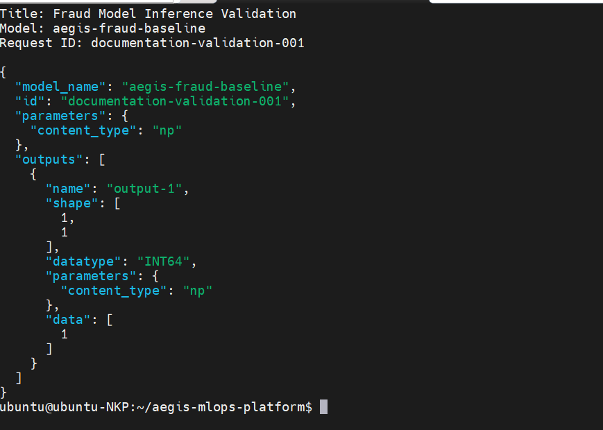
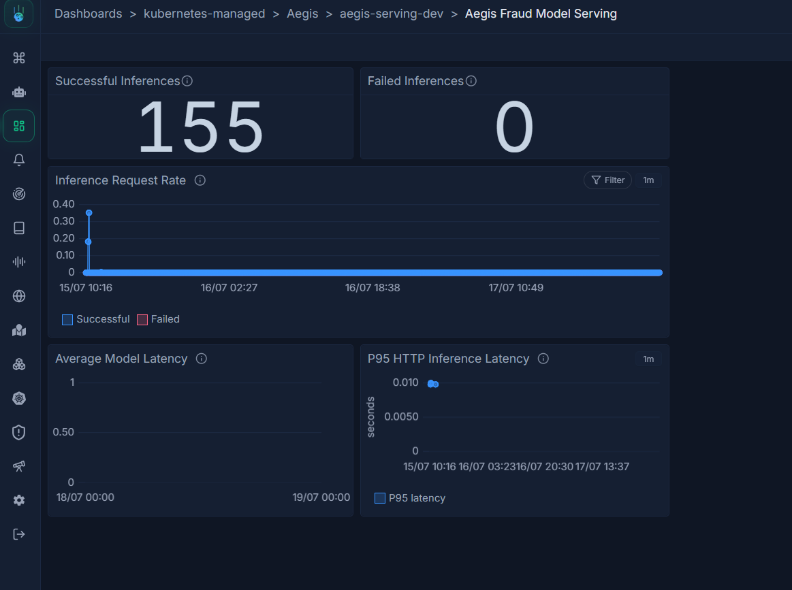
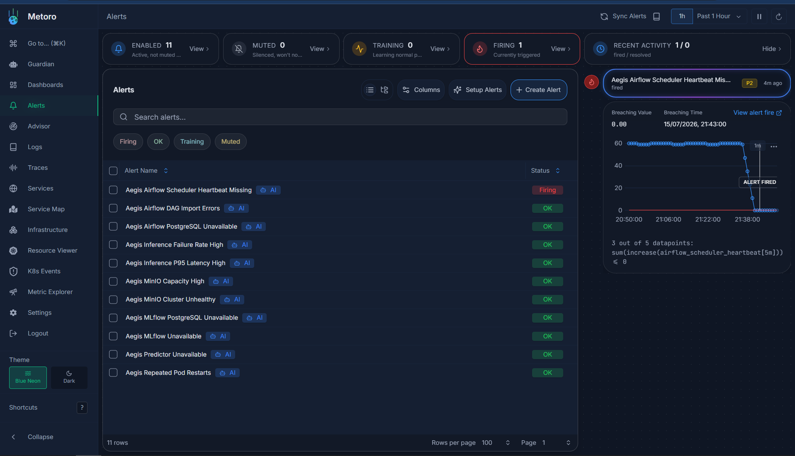

<div align="center">

# Aegis MLOps Platform

### An on-premises, Kubernetes-native MLOps platform engineered end to end on Nutanix Kubernetes Platform

**Data → Features → Training → Registry → Serving → Observability**

[](#architecture)
[](#gitops-delivery)
[](#validated-stack)
[](#validated-stack)
[](#online-inference)
[](#validated-stack)
[](#observability)
[](#project-status)

[](https://github.com/bakralakhras/MLOPS_NKP/commits/main)
[](https://github.com/bakralakhras/MLOPS_NKP)

</div>

---

## Executive Summary

Aegis is a flagship platform-engineering project that demonstrates how to operate the machine-learning lifecycle on an on-premises Kubernetes platform using open, composable infrastructure.

The system was designed and implemented as an eight-phase MLOps platform rather than as a standalone model notebook. It combines infrastructure engineering, GitOps, data pipelines, model lifecycle management, secure workload isolation, online inference and full-stack observability.

The validated platform delivered:

- a four-node distributed MinIO object-storage layer
- raw, bronze, silver and gold data processing
- Kubernetes-native Airflow orchestration
- containerized fraud-model training
- MLflow experiment tracking and model registration
- a separate time-aware feature-engineering workflow
- KServe and MLServer online inference
- Flux-driven continuous reconciliation
- Vault-backed secret storage
- default-deny network isolation
- Metoro dashboards, alerts, logs, traces and eBPF visibility
- successful end-to-end fraud inference through an internal HTTPS endpoint

> This repository is intentionally honest about scope: Aegis is a production-style, enterprise-oriented implementation validated in a temporary NKP lab. It is not represented as a fully highly available production service.

## Architecture


The architecture is organized around five operational planes:

| Plane | Responsibility |
|---|---|
| **GitOps control plane** | GitHub and Flux continuously reconcile the cluster from version-controlled desired state |
| **Data and feature plane** | MinIO stores lifecycle datasets; Airflow runs training and feature-engineering workloads |
| **ML lifecycle plane** | scikit-learn trains the model; MLflow tracks runs, metrics, artifacts and registered versions |
| **Serving plane** | KServe and a custom MLServer runtime load the selected MinIO artifact and expose V2 inference |
| **Security and observability plane** | Vault, Kubernetes controls and MinIO IAM protect workloads; Metoro provides operational visibility |

Editable architecture source:

```text
docs/assets/aegis-architecture.drawio
```

Detailed design:

- [Architecture documentation](docs/aegis-architecture.md)
- [Model lifecycle](docs/model-lifecycle.md)
- [Deployment guide](docs/deployment.md)

## What I Engineered

### Platform foundation

- nine purpose-specific Kubernetes namespaces
- Pod Security Admission labels
- ResourceQuotas and LimitRanges
- dedicated ServiceAccounts and RBAC
- default-deny NetworkPolicies
- explicit cross-namespace connectivity rules
- Nutanix CSI-backed persistent storage
- Traefik internal ingress
- Flux bootstrap and Kustomize reconciliation

### Data platform

- four-replica distributed MinIO StatefulSet
- 50 GiB persistent volume per MinIO replica
- S3-compatible raw, bronze, silver, gold, feature and MLflow artifact buckets
- workload-specific MinIO identities and IAM policies
- explicit network paths for Airflow, MLflow, feature workloads and KServe

### Machine-learning lifecycle

- deterministic synthetic fraud-transaction generation
- validation before model training
- raw → bronze → silver → gold transformation
- twelve-feature fraud-classification schema
- scikit-learn `RandomForestClassifier`
- metric and artifact logging to MLflow
- model registration and version traceability
- validated model version 4 served through KServe

### Feature engineering

- time-aware customer, merchant and device features
- protection against future-data leakage
- separate feature and observation Parquet outputs
- versioned and current datasets in MinIO
- Feast-compatible registry assets
- historical feature retrieval validation

### Online serving

- KServe `InferenceService` in RawDeployment mode
- custom non-root MLServer runtime
- pinned Python and model-serving dependencies
- MinIO model-artifact retrieval
- V2 HTTP and gRPC inference protocols
- dedicated serving identity and least-privilege artifact access
- internal HTTPS route through Traefik

### Observability

- ServiceMonitor and PodMonitor discovery
- MLServer serving metrics
- Airflow StatsD metrics
- MinIO metrics
- MLflow Prometheus metrics
- PostgreSQL exporters
- Metoro metrics, logs, traces and eBPF context
- four operational dashboards
- eleven platform and serving alerts
- Guardian AI investigation context

## Platform at a Glance

| Metric | Validated implementation |
|---|---:|
| Delivery phases | 8 |
| Aegis namespaces | 9 |
| MinIO replicas | 4 |
| MinIO persistent capacity | 200 GiB requested |
| Model input features | 12 |
| Registered serving model | `aegis-fraud-baseline` |
| Validated model version | 4 |
| Operational dashboards | 4 |
| Operational alerts | 11 |
| Serving protocols | V2 HTTP and gRPC |
| GitOps branch | `main` |
| Primary Flux Kustomization | `aegis-system/aegis-dha-nkp` |

## Validated Stack

The following versions are pinned in the repository or validated by the deployed manifests.

| Component | Version / implementation | Role |
|---|---|---|
| Apache Airflow | `3.2.2` | Workflow orchestration |
| Airflow Helm chart | `1.22.0` | Airflow deployment through Flux |
| MLflow | `2.16.2` | Experiment tracking and model registry |
| MLServer | `1.5.0` | Model-serving runtime |
| MLServer MLflow runtime | `1.5.0` | MLflow artifact loading |
| scikit-learn | `1.5.2` | Fraud classifier |
| Python | `3.11` | Training and serving images |
| pandas | `2.2.3` | Dataset processing |
| NumPy | `2.1.1` | Numerical operations |
| PyArrow | `17.0.0` | Parquet support |
| Feast | `0.64.0` | Feature-registry compatibility |
| s3fs | `2026.6.0` | S3-backed feature access |
| MinIO | `RELEASE.2025-05-24T17-08-30Z` | Distributed object storage |
| Vault | `1.19.0` | Central secret source |
| Vault Helm chart | `0.30.1` | Vault deployment through Flux |
| PostgreSQL | `16.4` | MLflow metadata database |
| KServe | Cluster-provided CRDs | Inference workload management |
| Flux | Cluster-provided controllers | GitOps reconciliation |
| Traefik | Cluster-provided ingress | Internal HTTPS routing |
| Metoro | Cluster-provided platform | Observability and Guardian AI |
| StorageClass | `nutanix-volume` | Persistent storage |

## End-to-End Lifecycle

### Training path

```text
Airflow training DAG
        │
        ▼
Kubernetes training pod
        │
        ├── Generate synthetic transactions
        ├── Validate source data
        ├── Build raw / bronze / silver / gold layers
        ├── Train RandomForestClassifier
        ├── Evaluate the model
        ├── Persist datasets to MinIO
        └── Log run, metrics and model to MLflow
```

Validated model identity:

```text
Registered model: aegis-fraud-baseline
Serving version: 4
MLflow run ID: 8296806d2a764f9fa61929242f137213
```

Validated artifact:

```text
s3://aegis-mlflow-artifacts/3/8296806d2a764f9fa61929242f137213/artifacts/model
```

### Feature path

```text
Latest Phase 5 silver dataset
        │
        ▼
Airflow feature-engineering DAG
        │
        ▼
Time-aware feature workload
        │
        ├── Customer features
        ├── Merchant features
        ├── Device features
        └── Training observations
        │
        ▼
MinIO offline feature storage
```

Current feature dataset:

```text
s3://aegis-features/phase6/training/current/fraud_training_dataset.parquet
```

The feature pipeline is a separately validated platform capability. It did not train registered model version 4.

### Online inference

```text
MLflow registered version
        │ artifact reference
        ▼
MinIO model artifact
        │ download
        ▼
KServe + custom MLServer runtime
        │
        ▼
Traefik internal HTTPS route
        │
        ▼
Fraud API client
```

Validated serving resources:

```text
Namespace:          aegis-serving-dev
InferenceService:   aegis-fraud-baseline
ServingRuntime:     aegis-mlflow-runtime
ServiceAccount:     aegis-inference
Predictor Service:  aegis-fraud-baseline-predictor
Metrics Service:    aegis-fraud-baseline-metrics
```

The client supplies all twelve model features directly. The validated implementation does not claim online feature retrieval from Feast.

## Model Results

The purpose of the model is to validate the platform lifecycle, not to claim production fraud accuracy.

| Metric | Validated baseline |
|---|---:|
| Accuracy | ~0.74 |
| Precision | ~0.32 |
| Recall | ~0.42 |
| F1 score | ~0.37 |
| ROC AUC | ~0.66 |

Successful inference returned an `INT64` fraud classification:

```json
{
  "model_name": "aegis-fraud-baseline",
  "id": "documentation-validation-001",
  "outputs": [
    {
      "name": "output-1",
      "shape": [1, 1],
      "datatype": "INT64",
      "data": [1]
    }
  ]
}
```

## Engineering Decisions

### GitOps instead of imperative deployment

All permanent Kubernetes resources are stored in Git and reconciled by Flux.

```text
Edit → Render → Dry-run → Commit → Push → Reconcile → Verify
```

This provides:

- declarative desired state
- auditable change history
- drift correction
- repeatable deployment
- rollback through Git

### Separate metadata from artifacts

Application metadata and binary artifacts use different storage systems.

```text
MLflow PostgreSQL
  └── runs, parameters, metrics and registry metadata

MinIO
  └── datasets, model files and evaluation artifacts
```

The same separation applies to Airflow, whose orchestration state is held in PostgreSQL rather than object storage.

### Custom serving runtime for dependency compatibility

The original platform runtime did not match the training environment closely enough for reliable model loading.

A custom MLServer image was built with pinned versions of:

- MLServer
- MLServer MLflow support
- MLflow
- scikit-learn
- cloudpickle
- protobuf

The runtime executes as a non-root user and is referenced by immutable image digest in the current serving manifest.

### Default-deny networking

Namespaces begin from a restricted network posture.

Only required paths are opened, including:

- Airflow → MinIO
- Airflow → MLflow
- feature workloads → MinIO
- MLflow → PostgreSQL and MinIO
- KServe → MinIO
- Metoro → metrics endpoints

### Time-aware feature calculation

The feature workflow calculates historical values using only transactions that occurred before the observation timestamp.

Transactions sharing the same timestamp are processed as a batch so they cannot observe each other. This avoids an arbitrary ordering dependency and reduces feature leakage.

### Evidence over claims

The repository includes cluster snapshots and screenshots for:

- GitOps reconciliation
- storage
- successful pipelines
- MLflow tracking
- registered model artifacts
- KServe readiness
- successful inference
- security controls
- metrics discovery
- dashboards and alerts

## GitOps Delivery

The repository is environment-specific and is not intended as a one-command local demo.

Primary overlay:

```text
clusters/dha-nkp
```

Render the desired state:

```bash
kubectl kustomize clusters/dha-nkp > /tmp/aegis-rendered.yaml
```

Validate it:

```bash
test -s /tmp/aegis-rendered.yaml

kubectl apply \
  --dry-run=client \
  -f /tmp/aegis-rendered.yaml
```

Reconcile through Flux:

```bash
flux reconcile source git aegis-dha-nkp \
  -n aegis-system

flux reconcile kustomization aegis-dha-nkp \
  -n aegis-system \
  --with-source
```

Verify:

```bash
kubectl -n aegis-system get kustomization aegis-dha-nkp
```

Expected state:

```text
READY=True
```

Direct `kubectl apply` is not the normal delivery path for permanent resources.

## Security Model

Aegis applies defense in depth:

| Layer | Controls |
|---|---|
| Namespace | Dedicated namespaces, quotas and limit ranges |
| Admission | Pod Security Admission labels |
| Workload | Non-root users, dropped capabilities, seccomp and restricted security contexts |
| Identity | Dedicated ServiceAccounts and RBAC |
| Network | Default-deny policies and explicit cross-namespace access |
| Object storage | MinIO users and least-privilege IAM policies |
| Secrets | Vault KV v2 and Kubernetes Secrets |
| Registry | GHCR image-pull Secret |
| Delivery | Git-based desired state and Flux reconciliation |

Secret path:

```text
Vault KV v2
        │ manual synchronization
        ▼
Kubernetes Secrets
        │
        ▼
Application workloads
```

Automated Vault injection was not implemented. Secret values and unseal material are not committed to Git.

## Observability

Metoro is the primary observability platform for Aegis.

Telemetry path:

```text
Workloads and nodes
    ├── Metrics endpoints and exporters
    │       ▼
    │   ServiceMonitor / PodMonitor
    │       ▼
    │   Metoro scraping
    │
    └── eBPF, logs, traces and infrastructure context
            ▼
          Metoro
            ▼
   Dashboards, alerts and Guardian AI
```

Implemented dashboards:

- Aegis Platform Overview
- Aegis Platform Services
- Aegis Pipelines
- Aegis Fraud Model Serving

Implemented alert coverage includes:

- predictor unavailable
- high inference failure rate
- high P95 latency
- Airflow scheduler heartbeat missing
- Airflow DAG import errors
- MLflow unavailable
- MinIO unhealthy
- MinIO capacity
- Airflow PostgreSQL unavailable
- MLflow PostgreSQL unavailable
- repeated pod restarts

## Validation Evidence

<table>
<tr>
<td width="50%">

**GitOps reconciliation**



</td>
<td width="50%">

**Model training**



</td>
</tr>
<tr>
<td width="50%">

**Registered model**



</td>
<td width="50%">

**Online inference**



</td>
</tr>
<tr>
<td width="50%">

**Serving dashboard**



</td>
<td width="50%">

**Operational alerts**



</td>
</tr>
</table>

Full evidence:

```text
docs/evidence/cluster-snapshot-20260718-013720/
docs/assets/screenshots/
```

## Repository Structure

```text
.
├── apps/
│   ├── features/               # Feature-engineering image and logic
│   ├── monitoring/             # Monitoring and drift prototype code
│   ├── serving/                # Custom MLServer image
│   └── training/               # Training image and model code
├── clusters/
│   └── dha-nkp/
│       ├── airflow/            # Airflow HelmRelease and DAG delivery
│       ├── data/               # MinIO resources and data access
│       ├── features/           # Feature workloads
│       ├── ml/                 # MLflow and PostgreSQL
│       ├── monitoring/         # Monitors, dashboards and alerts
│       ├── security/           # Vault
│       ├── serving/            # KServe runtime and InferenceService
│       └── system/             # Cluster integration
├── docs/
│   ├── aegis-architecture.md
│   ├── model-lifecycle.md
│   ├── deployment.md
│   ├── assets/
│   ├── evidence/
│   ├── operations/
│   ├── phases/
│   ├── runbooks/
│   └── security/
└── README.md
```

## Internal Routes

The validated lab routes were:

```text
https://mlflow.aegis.ntnxlab.local
https://airflow.aegis.ntnxlab.local
https://minio.aegis.ntnxlab.local
https://fraud-api.aegis.ntnxlab.local
```

These are internal endpoints and are not publicly reachable services.

## Project Status

### Completed and validated

- Kubernetes foundation and namespace isolation
- Flux GitOps reconciliation
- distributed MinIO storage
- Vault deployment and secret storage
- MLflow and PostgreSQL
- Airflow and PostgreSQL
- model-training pipeline
- offline feature pipeline
- MLflow model registration
- KServe and MLServer serving
- successful fraud inference
- service and database metrics
- Metoro dashboards and alerts
- final cluster evidence

### Deliberately outside final scope

- automated retraining
- automated model approval and promotion
- canary and A/B deployment
- online feature retrieval during inference
- production-scale load testing
- production drift detection
- public internet exposure
- validated deployment in `aegis-serving-prod`
- fully validated high availability
- disaster-recovery testing

A drift-monitoring workflow was implemented as a prototype but excluded from final completion because the temporary environment was scheduled for teardown before production hardening.

## Documentation

| Document | Purpose |
|---|---|
| [Architecture](docs/aegis-architecture.md) | Component responsibilities and validated system flows |
| [Model lifecycle](docs/model-lifecycle.md) | Data generation through inference |
| [Deployment guide](docs/deployment.md) | GitOps deployment and operational validation |
| [Architecture source](docs/assets/aegis-architecture.drawio) | Editable draw.io architecture |
| [Cluster evidence](docs/evidence/cluster-snapshot-20260718-013720/) | Final Kubernetes evidence snapshot |
| [Screenshots](docs/assets/screenshots/) | Visual validation evidence |

## Ownership

Designed and implemented by **Bakr Alakhras** as an end-to-end platform-engineering and MLOps portfolio project.

The work covers:

- Kubernetes platform architecture
- GitOps
- storage
- security
- orchestration
- machine-learning pipelines
- model serving
- observability
- operational documentation

Repository: [bakralakhras/MLOPS_NKP](https://github.com/bakralakhras/MLOPS_NKP)

---

<div align="center">

**Aegis demonstrates the engineering required to move a model from data to a secure, observable Kubernetes inference service—not merely the model-training code.**

</div>
