# Aegis MLOps Platform Architecture

## Purpose

Aegis is an on-premises, Kubernetes-native MLOps platform built around a fraud-detection use case.

The platform demonstrates an end-to-end lifecycle covering:

- object storage and dataset management
- feature engineering
- containerized model training
- experiment tracking
- model registration
- online inference
- GitOps delivery
- secrets management
- network and workload security
- metrics discovery
- dashboards and operational alerts

Aegis runs on Nutanix Kubernetes Platform and uses Kubernetes-native control patterns for deployment, isolation, orchestration, serving and monitoring.

## Architecture Diagram


Editable source:

```text
docs/assets/aegis-architecture.drawio
```

Rendered source:

```text
docs/assets/aegis-architecture.svg
```

## Platform Summary

The primary platform components are:

| Capability | Implementation |
|---|---|
| Kubernetes platform | Nutanix Kubernetes Platform |
| GitOps | GitHub and Flux |
| Object storage | MinIO |
| Pipeline orchestration | Apache Airflow |
| Feature engineering | Python workloads orchestrated by Airflow |
| Feature management | Feast-compatible registry and offline Parquet assets |
| Model training | Python and scikit-learn |
| Experiment tracking | MLflow |
| Model registry | MLflow Model Registry |
| Model serving | KServe and MLServer |
| Ingress | Traefik |
| Secrets management | HashiCorp Vault and Kubernetes Secrets |
| Metrics discovery | ServiceMonitor and PodMonitor resources |
| Observability | Metoro |
| Analysis | Metoro Guardian AI |
| Platform telemetry | Metrics, logs, traces and eBPF-based visibility |

## Kubernetes Platform Boundary

Aegis runs inside Nutanix Kubernetes Platform.

The cluster provides:

- Kubernetes workload scheduling
- Nutanix CSI-backed persistent storage
- Calico networking
- namespace isolation
- Kubernetes Services and Ingress
- Pod Security Admission
- custom resource support for Flux, KServe, ServiceMonitor, PodMonitor, MetoroDashboard and MetoroAlert resources

The platform is divided into dedicated namespaces:

| Namespace | Responsibility |
|---|---|
| `aegis-system` | Flux reconciliation and shared platform resources |
| `aegis-data` | MinIO datasets and artifacts |
| `aegis-airflow` | Airflow orchestration and Airflow PostgreSQL |
| `aegis-features` | Feature-engineering workloads and Feast-compatible assets |
| `aegis-ml` | MLflow and MLflow PostgreSQL |
| `aegis-serving-dev` | Validated development model-serving environment |
| `aegis-serving-prod` | Reserved production-serving namespace |
| `aegis-monitoring` | Metrics-discovery resources |
| `aegis-security` | Vault and security-related resources |

The namespace layout separates platform responsibilities and supports independent quotas, service accounts, network policies and Pod Security settings.

Evidence:

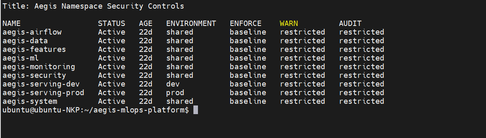

## GitOps Control Plane

GitHub is the source of truth for Aegis Kubernetes configuration.

The repository contains:

- Kubernetes manifests
- HelmRelease resources
- Kustomize overlays
- Flux resources
- Airflow DAG definitions
- KServe resources
- monitoring dashboards
- operational alerts
- network policies
- security controls
- documentation

The delivery flow is:

```text
Engineer
   ↓ commit and push
GitHub repository
   ↓ Flux pulls desired state
Flux
   ↓ reconciliation
Nutanix Kubernetes Platform
```

The main Flux Kustomization is:

```text
aegis-system/aegis-dha-nkp
```

Permanent platform changes follow this workflow:

```text
Edit
   ↓
Render
   ↓
Dry-run validation
   ↓
Commit
   ↓
Push
   ↓
Flux reconciliation
   ↓
Cluster verification
```

Direct `kubectl apply` is not the normal delivery mechanism for permanent resources.

Evidence:


## Object Storage Architecture

MinIO provides the S3-compatible storage layer.

Representative buckets include:

- `aegis-raw`
- `aegis-bronze`
- `aegis-silver`
- `aegis-gold`
- `aegis-features`
- `aegis-mlflow-artifacts`
- `aegis-model-artifacts`
- `aegis-prediction-logs`
- `aegis-airflow-logs`

MinIO stores datasets and binary artifacts. Application metadata is stored separately in PostgreSQL.

### Storage responsibilities

| Storage location | Responsibility |
|---|---|
| `aegis-raw` | Source transaction data |
| `aegis-bronze` | Ingested and normalized data |
| `aegis-silver` | Cleaned and validated transaction data |
| `aegis-gold` | Training-ready fraud datasets |
| `aegis-features` | Offline feature tables and training observations |
| `aegis-mlflow-artifacts` | MLflow model and evaluation artifacts |
| `aegis-model-artifacts` | Reserved model-artifact location |
| `aegis-prediction-logs` | Reserved prediction-log location |
| `aegis-airflow-logs` | Reserved Airflow log storage |

Evidence:

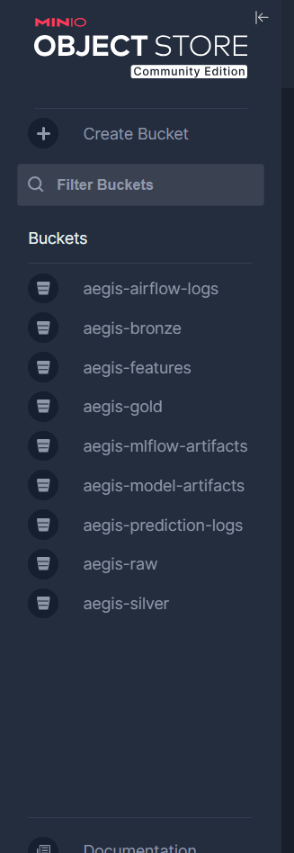

## Pipeline Orchestration

Apache Airflow orchestrates the model-training and feature-engineering workflows.

Airflow uses:

- KubernetesExecutor
- KubernetesPodOperator
- ConfigMap-delivered DAGs
- dedicated Kubernetes service accounts
- a PostgreSQL metadata database
- StatsD metrics
- Kubernetes-based monitoring discovery

The primary DAGs are:

| DAG | Capability |
|---|---|
| `aegis_phase_4_validation` | Platform validation pipeline |
| `aegis_phase_5_training` | Fraud-model training pipeline |
| `aegis_phase_6_feature_pipeline` | Fraud feature-engineering pipeline |
| `aegis_phase_8_drift_monitor` | Drift-monitoring prototype |

The platform uses Airflow as an orchestrator. Airflow launches isolated Kubernetes workloads rather than performing model training or feature calculation inside the scheduler itself.

Evidence:

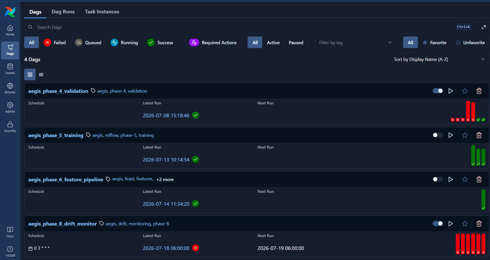

## Validated Model-Training Flow

The deployed fraud model was produced by the model-training workflow.

The Airflow DAG launches the custom image:

```text
ghcr.io/bakralakhras/aegis-training:phase5
```

The training container performs the following operations:

1. generates a synthetic fraud-transaction dataset
2. validates the source dataset
3. creates raw, bronze, silver and gold representations
4. creates the twelve-feature training table
5. splits the dataset into training and test sets
6. trains a scikit-learn `RandomForestClassifier`
7. calculates evaluation metrics
8. persists datasets to MinIO
9. logs parameters, metrics and artifacts to MLflow
10. registers the model in MLflow Model Registry

The accurate flow is:

```text
Airflow training DAG
   ↓
Kubernetes training pod
   ├── generate and validate transactions
   ├── build raw, bronze, silver and gold data
   ├── train scikit-learn model
   ├── persist datasets to MinIO
   └── log run, metrics and model to MLflow
```

The validated model is:

```text
aegis-fraud-baseline
```

The validated serving version is:

```text
Version 4
```

The validated MLflow run ID is:

```text
8296806d2a764f9fa61929242f137213
```

Evidence:


## Fraud Features

The trained model uses twelve input features:

1. `amount`
2. `hour_of_day`
3. `customer_tx_count_1h`
4. `customer_spend_1h`
5. `customer_avg_amount_30d`
6. `merchant_fraud_rate_30d`
7. `device_seen_before`
8. `is_cross_border`
9. `amount_vs_customer_average`
10. `is_night_transaction`
11. `is_high_velocity_customer`
12. `is_high_merchant_risk`

These values form the model input schema registered with MLflow and accepted by the inference API.

## Feature-Management Flow

Feature management is a separate capability from the model-version-4 training run.

The feature-engineering workflow:

1. reads the latest silver transaction dataset from MinIO
2. calculates time-aware customer, merchant and device features
3. avoids future-data leakage by using only events earlier than each observation timestamp
4. produces customer, merchant, device and observation Parquet tables
5. writes versioned and current outputs to MinIO
6. validates Feast registry compatibility and historical feature retrieval

The feature-management flow is:

```text
MinIO silver dataset
   ↓
Airflow feature-engineering DAG
   ↓
Kubernetes feature-engineering pod
   ↓
Feature tables and training observations
   ↓
MinIO offline feature storage
```

The current feature dataset is stored under:

```text
s3://aegis-features/phase6/training/current/
```

The feature-management branch was validated independently.

It was not the direct source used to train MLflow model version 4. Model version 4 was produced by the earlier training workflow, which created its own gold training dataset inside the training container.

Evidence:

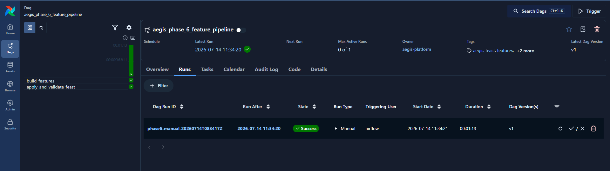

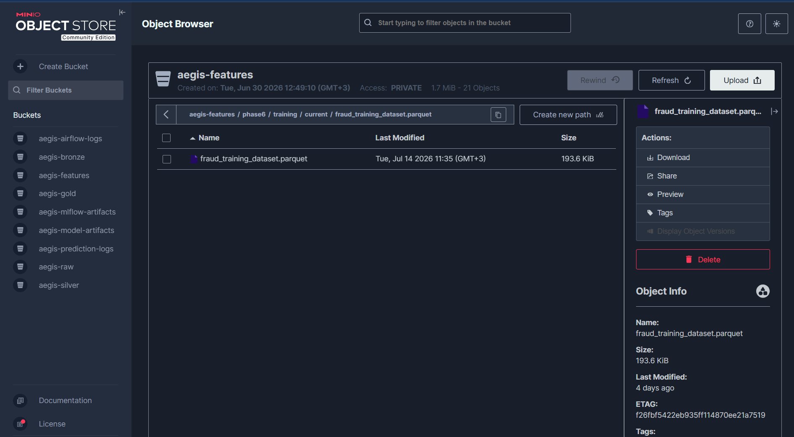

## MLflow Tracking and Model Registry

MLflow provides:

- experiment tracking
- run parameters
- evaluation metrics
- model signatures
- artifact references
- model registration
- model-version traceability

MLflow uses two storage layers:

```text
MLflow PostgreSQL
   └── runs, parameters, metrics and registry metadata

MinIO
   └── model files, evaluation artifacts and supporting files
```

The validated model artifact path is:

```text
s3://aegis-mlflow-artifacts/3/8296806d2a764f9fa61929242f137213/artifacts/model
```

The model artifact contains files such as:

- `MLmodel`
- `model.pkl`
- `conda.yaml`
- `python_env.yaml`
- `requirements.txt`
- model input examples
- serving input examples

Evidence:

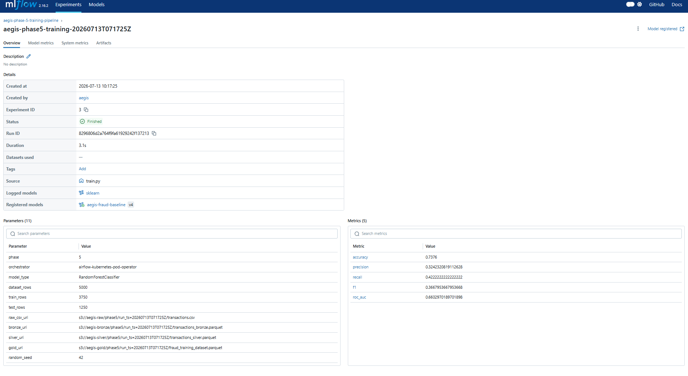

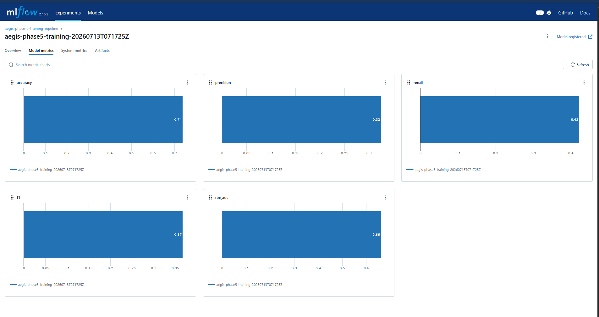


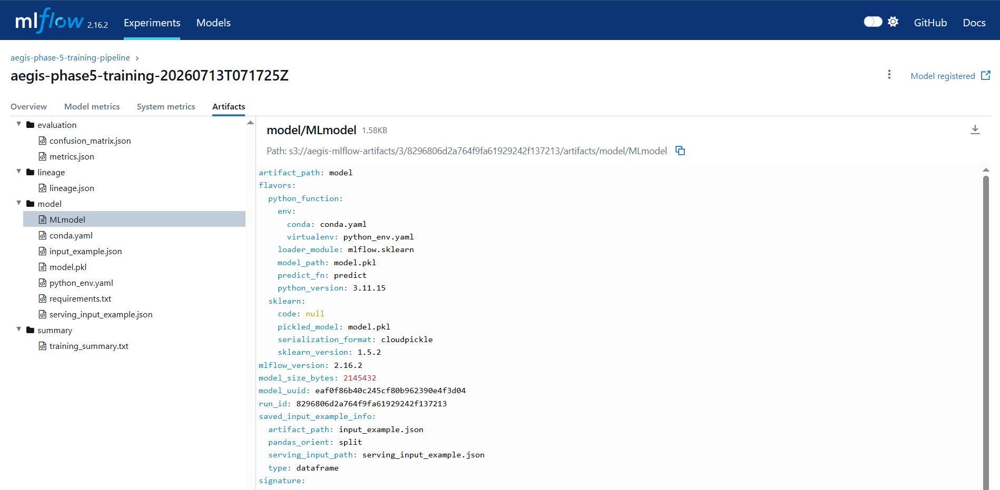

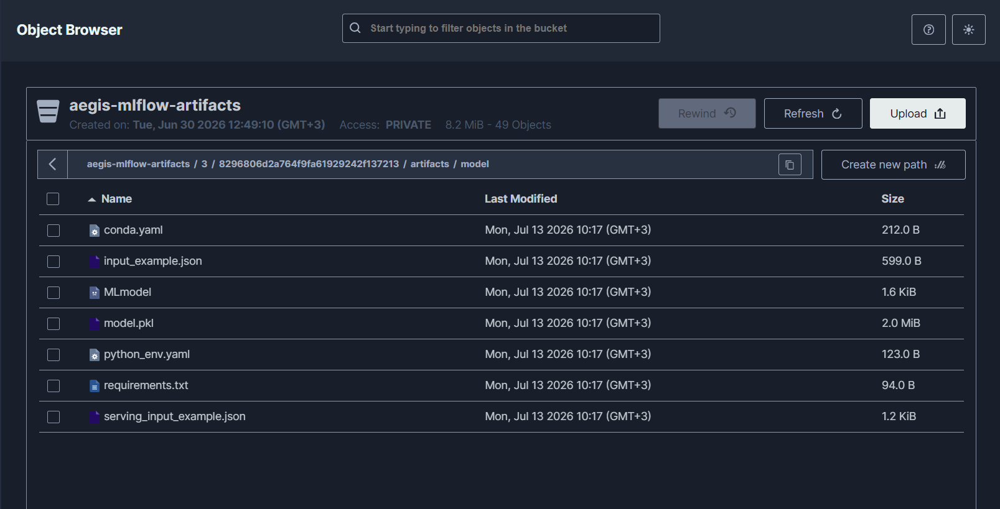

## Model-Serving Architecture

KServe manages the fraud-model inference workload in:

```text
aegis-serving-dev
```

The serving implementation uses:

- KServe `InferenceService`
- RawDeployment mode
- a custom MLServer runtime
- MinIO model-artifact download
- the V2 inference protocol
- Traefik internal routing

The custom runtime image is:

```text
ghcr.io/bakralakhras/aegis-mlserver:phase7-v2
```

The serving flow is:

```text
MLflow registered model version
   ↓ selected version and artifact reference
MinIO MLflow artifact
   ↓ model download
KServe + MLServer
   ↓
Traefik
   ↓
Fraud API client
```

The request and response path is:

```text
Fraud API client
   ↓ HTTPS request
Traefik
   ↓ HTTP 8080
KServe + MLServer
   ↓ prediction response
Fraud API client
```

The client sends all twelve feature values directly in the inference request.

KServe does not retrieve online features from Feast in the validated implementation.

The validated response returned:

```json
{
  "model_name": "aegis-fraud-baseline",
  "id": "documentation-validation-001",
  "outputs": [
    {
      "name": "output-1",
      "shape": [1, 1],
      "datatype": "INT64",
      "data": [1]
    }
  ]
}
```

Evidence:

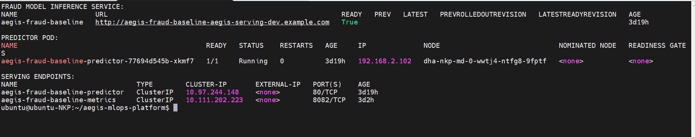

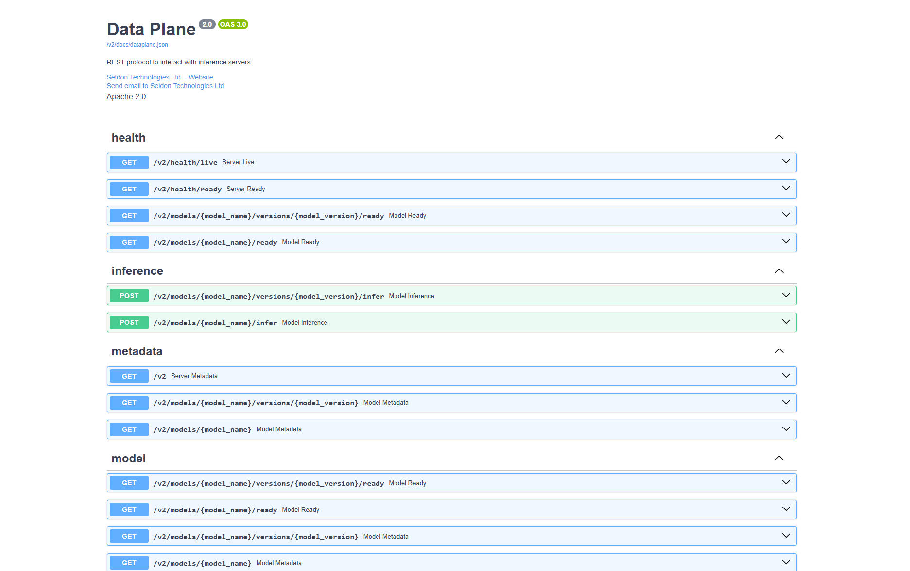


## Internal Service Exposure

Traefik exposes internal lab routes.

Representative routes include:

```text
https://mlflow.aegis.ntnxlab.local
https://airflow.aegis.ntnxlab.local
https://minio.aegis.ntnxlab.local
https://fraud-api.aegis.ntnxlab.local
```

The routes are internal to the lab environment and are not public internet endpoints.

## Secrets and Identity

HashiCorp Vault is deployed in:

```text
aegis-security
```

Vault provides the central secrets source of truth.

The deployed Vault configuration includes:

- standalone mode
- persistent storage backed by `nutanix-volume`
- Shamir manual unseal
- KV v2 secret storage under `aegis/`

Aegis stores application credentials in Vault and synchronizes them into Kubernetes Secrets for workload consumption.

The operational secret flow is:

```text
Vault KV v2
   ↓ secret synchronization
Kubernetes Secrets
   ↓
Application workloads
```

Examples of workload secret use include:

- MLflow PostgreSQL credentials
- MLflow MinIO artifact credentials
- Airflow credentials
- feature-pipeline MinIO credentials
- KServe model-storage credentials
- GHCR image-pull credentials

Known Kubernetes Secret names include:

```text
aegis-feast-s3-credentials
aegis-model-storage
ghcr-bakralakhras
```

Secret values must never be committed to Git or included in documentation.

## Kubernetes Security Controls

The platform applies multiple layers of Kubernetes security:

- dedicated namespaces
- Pod Security Admission labels
- non-root container execution
- restricted security contexts
- dropped Linux capabilities
- read-only root filesystems where supported
- resource requests and limits
- dedicated service accounts
- RBAC
- default-deny network policies
- explicit cross-namespace allowances
- MinIO users and IAM policies
- Kubernetes Secrets
- Vault-backed secret management
- image-pull secrets

The network model follows:

```text
Default deny
   ↓
Explicit workload-to-workload allowance
   ↓
Only required ports and namespaces
```

Evidence:

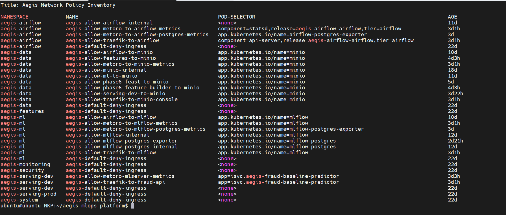


## Metrics Discovery

Aegis exposes Prometheus-compatible metrics from platform components.

Metrics are discovered through:

- `ServiceMonitor` resources
- `PodMonitor` resources
- component metric endpoints
- PostgreSQL exporters
- Airflow StatsD
- MLServer metrics
- MinIO metrics
- MLflow metrics

The metrics path is:

```text
Application or exporter endpoint
   ↓
Kubernetes Service
   ↓
ServiceMonitor or PodMonitor
   ↓
Metoro target allocation and scraping
   ↓
Metoro backend
```

Evidence:

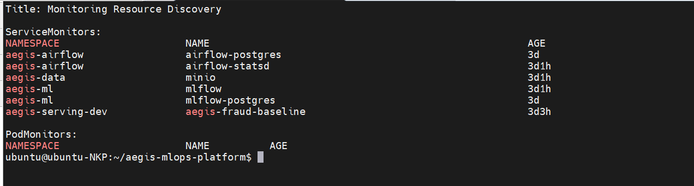

## Metoro Observability Architecture

Metoro is the primary observability solution used by Aegis.

Metoro provides:

- automatic Kubernetes discovery
- namespace, pod, service and node visibility
- Prometheus-compatible metric ingestion
- eBPF-based infrastructure visibility
- logs
- traces
- service topology
- dashboard rendering
- operational alerts
- Guardian AI analysis and anomaly context

The broader telemetry path is:

```text
NKP nodes and workloads
   ├── metrics endpoints and exporters
   │      ↓
   │   ServiceMonitor and PodMonitor
   │      ↓
   │   Metoro scraping
   │
   └── eBPF, logs, traces and infrastructure context
          ↓
        Metoro
          ↓
   Dashboards, alerts and Guardian AI
```

The implemented dashboards include:

- Aegis Platform Overview
- Aegis Platform Services
- Aegis Pipelines
- Aegis Fraud Model Serving

Evidence:

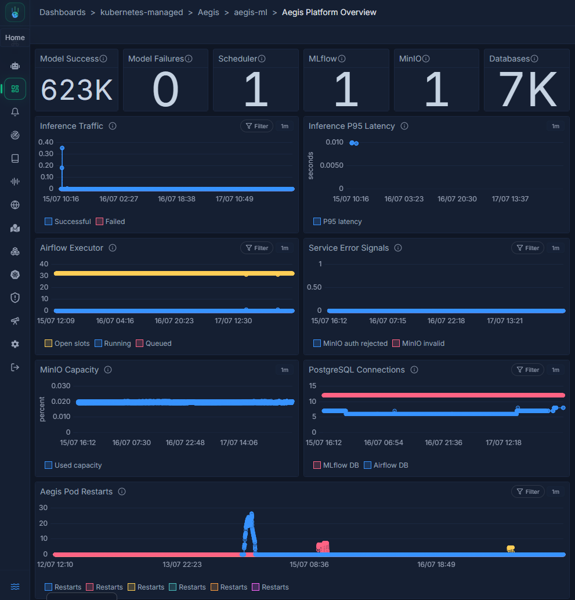

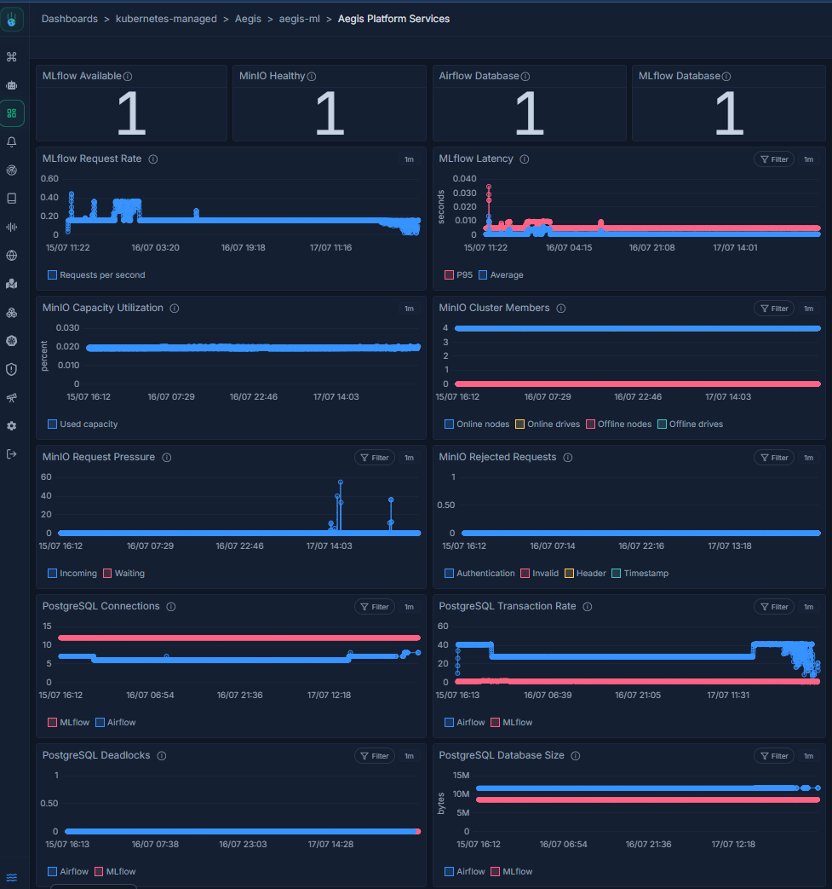

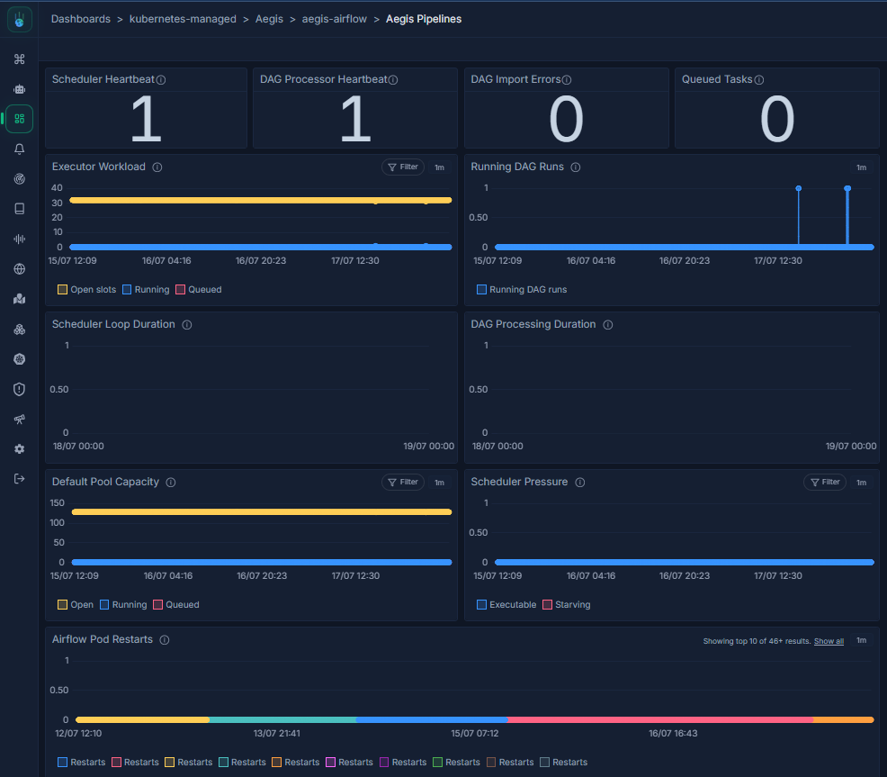


## Operational Alerts

Aegis includes operational alerts for platform and model-serving conditions.

Implemented alert coverage includes:

- predictor unavailable
- inference high failure rate
- inference high latency
- Airflow scheduler missing
- Airflow DAG import errors
- MLflow unavailable
- MinIO unhealthy
- MinIO capacity
- Airflow PostgreSQL unavailable
- MLflow PostgreSQL unavailable
- pod restarts

Evidence:


## Validated Architecture Paths

### Training

```text
Airflow
   ↓
Kubernetes training pod
   ↓
scikit-learn model training
   ↓
MLflow tracking and registry
   ↓
MinIO model artifact
```

### Feature engineering

```text
MinIO silver dataset
   ↓
Airflow
   ↓
Feature-engineering pod
   ↓
Feast-compatible offline feature tables
   ↓
MinIO feature bucket
```

### Serving

```text
MLflow model version 4
   ↓
MinIO artifact
   ↓
KServe and MLServer
   ↓
Traefik
   ↓
Successful V2 inference
```

### GitOps

```text
GitHub
   ↓
Flux
   ↓
NKP resources
```

### Secrets

```text
Vault
   ↓
Kubernetes Secrets
   ↓
Application workloads
```

### Monitoring

```text
Workloads and exporters
   ↓
ServiceMonitor and PodMonitor
   ↓
Metoro
   ↓
Dashboards and alerts
```

## Important Architecture Distinctions

### MLflow does not train the model

scikit-learn trains the model.

MLflow tracks the run, stores metadata references and registers the trained model.

### KServe does not train the model

KServe deploys and manages the inference workload.

MLServer loads the model artifact and exposes the V2 inference API.

### MinIO does not store all metadata

MinIO stores datasets and binary artifacts.

Airflow and MLflow metadata are stored in their respective PostgreSQL databases.

### Feast was not an online serving dependency

The validated inference client sends twelve feature values directly to MLServer.

KServe does not retrieve live feature values from Feast.

### The feature pipeline did not train model version 4

The validated model version 4 was created by the earlier training workflow.

The later feature-management workflow was validated as a separate, reusable feature capability.

## Scope Boundaries

The validated platform includes:

- Kubernetes-native deployment
- GitOps reconciliation
- MinIO object storage
- Airflow orchestration
- scikit-learn model training
- MLflow tracking and registry
- Feast-compatible offline feature assets
- KServe and MLServer inference
- internal Traefik routes
- Vault-backed secret management
- Kubernetes security controls
- Metoro dashboards and alerts

The following are outside the final validated scope:

- automated retraining
- automated model promotion
- production canary or A/B deployment
- production-scale load testing
- online feature retrieval during inference
- production drift detection
- public internet exposure
- fully validated high availability
- validated production serving in `aegis-serving-prod`

## Drift-Monitoring Prototype

A drift-monitoring workflow was implemented as a prototype.

The prototype demonstrated:

- Airflow DAG loading and scheduling
- KubernetesPodOperator execution
- execution in `aegis-features`
- MinIO authentication
- baseline and current dataset reads
- drift-script execution

The relevant files are:

```text
apps/monitoring/phase8/drift_check.py
clusters/dha-nkp/features/phase8-drift-script-configmap.yaml
clusters/dha-nkp/airflow/dags/aegis_phase_8_drift_monitor_dag.py
clusters/dha-nkp/airflow/airflow-phase8-drift-monitor-dag-configmap.yaml
```

The prototype is excluded from the final completion scope because the temporary NKP environment was scheduled for teardown before production hardening could be completed.

## Final Architecture Status

The Aegis MLOps Platform successfully demonstrated an end-to-end, Kubernetes-native MLOps lifecycle including data storage, feature engineering, model training, experiment tracking, model registration, online model serving, GitOps delivery, security controls, orchestration, metrics collection, dashboards and operational alerts.

The architecture should be described as:

- production-style
- enterprise-oriented
- Kubernetes-native
- GitOps-managed
- end-to-end

It should not be described as:

- fully production ready
- fully highly available
- zero downtime
- production drift detection
- automated retraining
- automated production promotion
